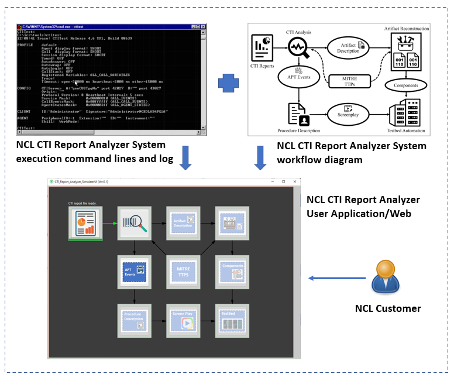
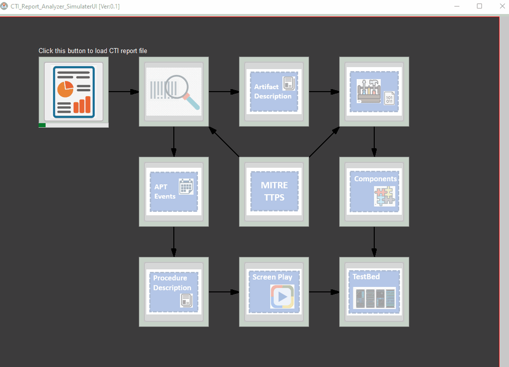
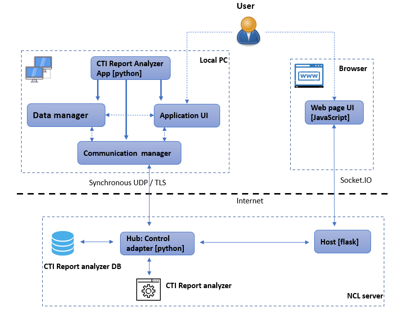
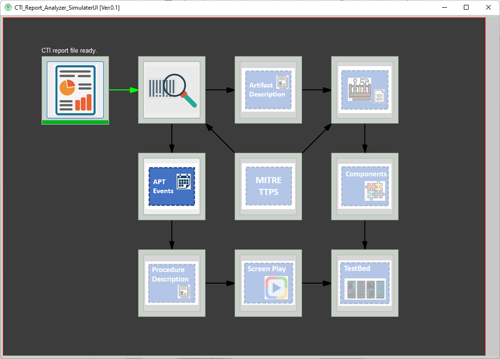

# Cyber Threat Intelligence (CTI) Reports_Analyzer_UI

**Program Design Purpose**: This project is a sub project (visualization) of NCL “Towards Automated and Large-scale Cyber Attack Reconstruction with APT Reports” (CTI Report Analyzer) Project. The CTI Report Analyzer is aimed to provide an automated platform for researchers and analysts to expedite their understanding and significantly reduce their turnaround time in addressing cyberthreats.

[TOC]

### Introduction

Cyber Threat Intelligence (CTI) reports are valuable sources that researchers and analysts seek to have a deeper understanding of the current APT activities and the cyberthreat landscape. These reports are used to obtain insights of vulnerabilities and their associated attack techniques.

The current NCL CTI Report Analyzer is a commend line-based system. The developer can do all the configure by cmd and monitor the process by checking the log. The CTI Report Analyzer Visualization project  will create Application and Web based UI for NCL customers to use and monitor the process to convert the rich details found in CTI reports to reconstruct a dynamic environment. 

**Program  General Design**



It is a group programming project aims to let National Cybersecurity R&D Laboratory (NCL) interns can pick up the knowledge about CTI report, different kinds of APT events, python UI development and webpage design. Then create an Application and Web which NCL user can use it to control and monitor their CTI report analysis process.

##### CTI Report Analyzer UI View



`version 0.12`


------

### Program Design

The CTI report analyzer UI project is aimed to provide two kinds of user interface which allow NCL customers can directly control and monitor their CTI report analysis progress. The program workflow is shown below:

#### Program Workflow 



The CTI report Analyzer UI program contents 7 main modules: 

1. **CTI Report Analyzer UI App Module**: Application program main frame running on users' local computer to initialize other modules with individual threads. 

2. **Data Manager Module**: Data processing module used to handle the input data checking, report file converting and data pre-processing for the CTI report which user upload. 

3. **Application User Interface Module**: The main UI module customers used to upload the CTI report, configure the report analysis parameters, monitor report analysis process and check the result. 

4. **Communication Manager Module**: The communication module to handle the data updating and data transfer (such as report upload). 

5. **Webpage UI Module**: The Web page with the same function as the Application UI module. 

6. **Web Host Module**: The Web Host program to handle the user control action on the UI and provide same function as the data manager.

7. **Control Hub Adapter**: The main control hub used to collect data from the CTI report analyzer and the data base. 

   

#### Program UI Design 

The main page for each module is shown below:



This task is aiming create 8 modules to show 8 pop-up windows to let the user to control/config their CTI report analysis and monitor the progress. 

- **CTI Report Loader** : The user can use this module to upload the CTI reports they want to analyze or select the reports provided by NCL. The module will pre-check the report’s format. 
- **CTI report Analysis Configure Module**: This module provides the report analysis algorithm selection and show the progress of the analyzing progress of the current report. 
- **Artifact Description Module**: After the CTI report analysis process finished, the result will show some artifact from the report, this module will provide a description dashboard for use the check the artifact result. 
- **Artifact Reconstruction Config Panel**: The control panel to configure the NCL Artifact reconstruction process. 
- **APT Events Display Dashboard**: A display dashboard panel to show all the APT event tree based on the report analyze result. 
- **Procedure Description**:  Under Editing. 
- **Screen Play:** Open browser to show the related NCL analysis/demo online video.
- **Testbed Configuration Module**: Using both Screenplay and related artifacts, an environment is reconstructed on the testbed. The reconstructed environment simulates the APT attack that is described in the CTI reports. Such simulated environment allows analysts to dynamically understand the APT attack. User can use this module to config the testbed and monitor the testbed working statues. 


------

### Program setup 

###### Development Environment : python 3.7.4

###### Additional Lib/Software Need

1. **wxPython** : https://docs.wxpython.org/index.html

   ```
   Install: pip install wxPython
   ```

2. Hardware Needed : None


###### Program Files List 

| Program File             | Execution Env | Description                                                  |
| ------------------------ | ------------- | ------------------------------------------------------------ |
| src/CASimulatorGlobal.py | python 3      | This module is used as a local config file to set constants, global parameters which will be used in the other modules |
| src/CASimulatorPanel.py  | python 3      | This module is used to create different function panels.     |
| src/CASimulatorUIRun.py  | python 3      | This module used for the CTI-Report Analyzer System Simulator UI main frame window. |
| src/DataMgr.py           | python 3      | Data manager module used to control all the other data processing modules and store the internal process/result data. |
| src/img                  |               | All the program needed image file.                           |


------

#### Program Usage

###### Program Execution 

```
python CASimulatorUIRun.py
```

###### 

------

#### Problem and Solution

Refer to `doc/ProblemAndSolution.md`


------

> Last edit by LiuYuancheng(liu_yuan_cheng@hotmail.com) at 08/05/2022

